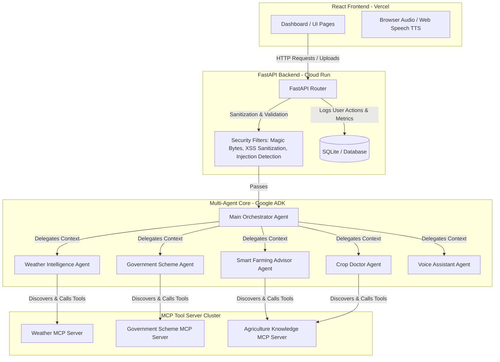
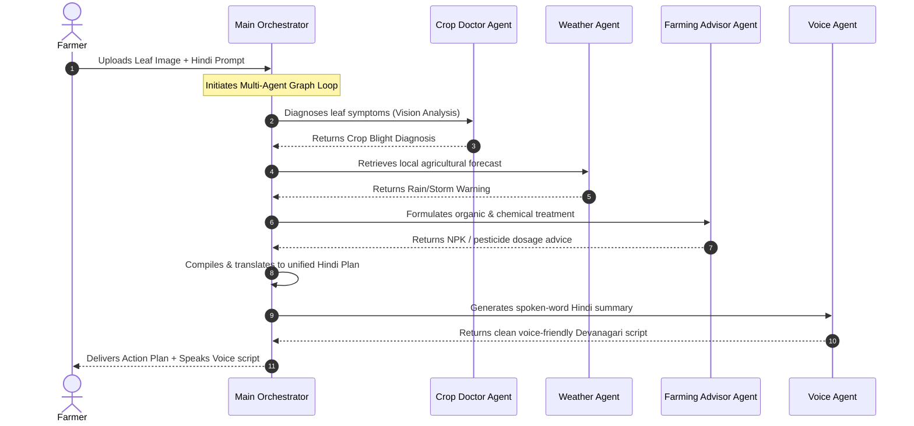

# KrishiMitra AI - Architecture Documentation

This document describes the architectural layout, multi-agent coordination, and Model Context Protocol (MCP) data pipelines of **KrishiMitra AI**.

---

## 1. System Architecture

KrishiMitra AI is structured as a full-stack, modular, three-tier application featuring a FastAPI backend, a React frontend, and a Google ADK-powered Multi-Agent reasoning hub integrated with a distributed MCP tool framework.

---

## 2. Multi-Agent Workflows

### A. General Request Routing
The Orchestrator acts as the central router:
1. Recieves query.
2. Identifies keyword/expression triggers.
3. Routes to the appropriate agent.
4. Returns response & logs metrics to the live Agent Activity Monitor.

### B. Farmer Emergency Mode (BONUS FEATURE)
When the Emergency Mode is activated (e.g. leaf spot issue description + image upload in Hindi):
1. **Orchestrator Agent** acts as the workflow coordinator.
2. **Crop Doctor Agent** performs Gemini Vision analysis on the uploaded leaf.
3. **Weather Intelligence Agent** reads the location and checks forecasts on the Weather MCP Server for imminent rain warnings.
4. **Smart Farming Advisor Agent** evaluates fertilizer regimens and organic/chemical pest treatment.
5. **Orchestrator Agent** aggregates all responses, translates and compiles them into a unified Hindi report.
6. **Voice Assistant Agent** extracts and synthesizes a spoken-word script in simple Hindi, which is read aloud in the frontend.

---

## 3. Database Schema

The SQLite database tracks all farmer activities and agent operations across five core schemas:

1. **`crop_scans`**: Logs diagnosed leaf photos, crop types, crop disease names, severity metrics, and treatment details.
2. **`weather_logs`**: Logs queried agricultural hubs, temperatures, rain probabilities, conditions, and recommendations.
3. **`scheme_logs`**: Logs searched schemes, matching outputs, and eligibility flags.
4. **`chat_messages`**: Holds advisor chat and voice assistant conversations.
5. **`agent_activities`**: Logs live agent coordination, collaboration paths, action summaries, latency times, and execution status (displayed in the live Activity Monitor).
