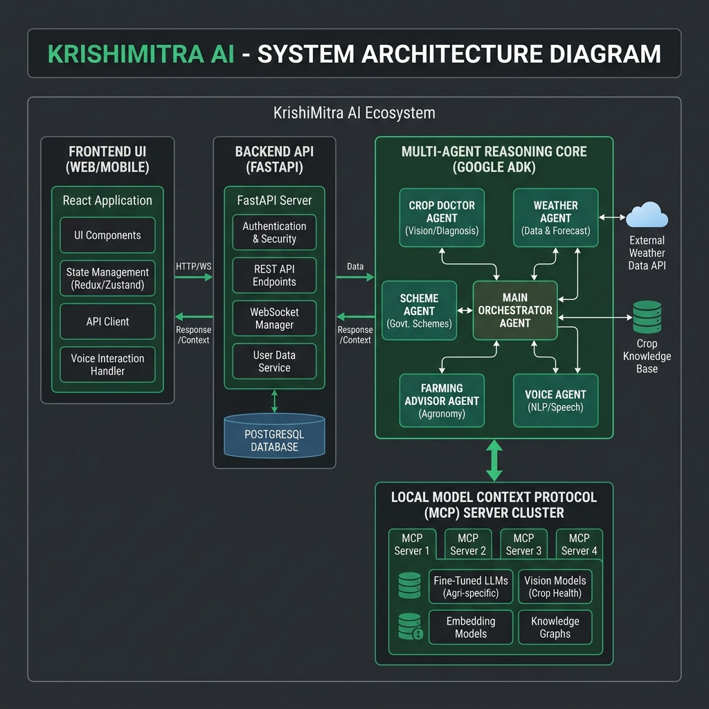
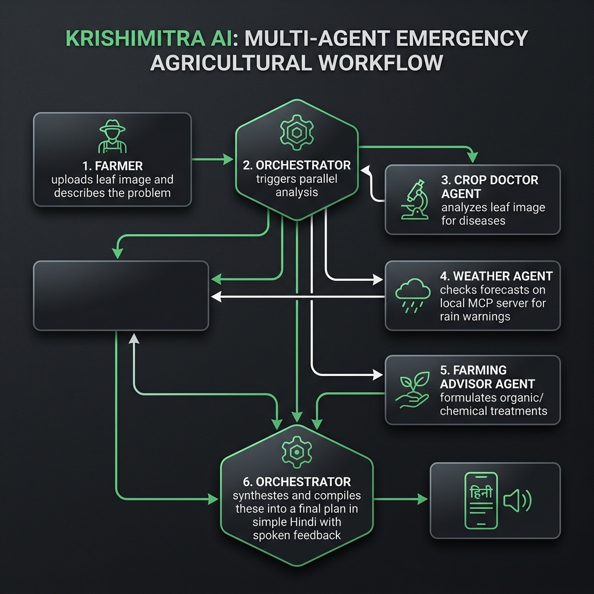

# 🌾 KrishiMitra AI - Farmers' Friend Multi-Agent Hub

**KrishiMitra AI** is a full-stack, production-ready AI multi-agent platform designed to support farmers under the "Agents for Good" track. The system features a modern agriculture-themed dashboard, specialized agents, local Model Context Protocol (MCP) servers, voice assistant capabilities, and a high-priority "Farmer Emergency Mode" (supporting Hindi image/text queries).

---

## 🌟 Key Features

1.  **Dashboard**: A centralized overview of crop stats, active weather warnings, recent scans, and live agent activity metrics.
2.  **Crop Disease Detection (Crop Doctor Agent)**: Analyzes leaf images using Gemini Vision, identifies disease common & scientific names, gauges severity, and generates both chemical and organic treatment plans.
3.  **Weather Intelligence (Weather Agent)**: Integrates with the Weather MCP server to provide crop management decisions (e.g. spray scheduling and irrigation suspension advice).
4.  **Government Schemes (Scheme Agent)**: Matches land ownership, land size, and taxpayer profiles against official criteria (PM-Kisan, KCC, Crop Insurance) to evaluate eligibility.
5.  **Smart Farming Advisor (Advisor Agent)**: Grounded by soil type, season, and region, this agent provides customized advice on seed selection, crop planning, and N-P-K fertilizer schedules.
6.  **Voice Assistant (Voice Agent)**: Transcribes Hindi and English voice queries via Deepgram and replies with voice-optimized spoken-word instructions.
7.  **Farmer Emergency Mode (Bonus Feature)**: A one-click diagnostic that triggers a parallel multi-agent workflow (Crop Doctor + Weather + Advisor) and outputs a unified plan in simple Hindi with spoken feedback.
8.  **Agent Activity Monitor**: Real-time logging of orchestrator routing, latency metrics, and agent collaboration steps.
9.  **User History Dashboard**: Full records of past scans, weather reports, and advisory chats with exporting utilities.


---

## 📊 Project Workflows & Architecture

### System Architecture
KrishiMitra AI utilizes a three-tier architecture connecting a responsive React frontend with a secure FastAPI gateway. The core reasoning is handled by specialized agents built using a Google ADK-inspired architecture. These agents dynamically discover and consume tools hosted by a localized Model Context Protocol (MCP) server cluster.



### Farmer Emergency Mode Sequence
When the emergency button is clicked (description + leaf photo), the system initiates a parallel multi-agent reasoning loop:
1. The **Orchestrator** coordinates the execution flow and starts timing.
2. The **Crop Doctor Agent** performs Gemini Vision analysis on the leaf image to identify the pathogen and estimate severity.
3. The **Weather Intelligence Agent** queries the Weather MCP server to inspect the local forecast for high-probability rain warnings.
4. The **Smart Farming Advisor Agent** evaluates fertilizer regimens and organic/chemical treatments.
5. The **Orchestrator** aggregates these outputs, compiling them into a unified, easy-to-understand action plan in Hindi.
6. The **Voice Agent** translates the plan into a voice-optimized spoken script.



---

## 🛠️ Technology Stack

*   **Frontend**: React (Vite) + TailwindCSS + Lucide Icons + native SpeechSynthesis API
*   **Backend**: FastAPI + Python 3.12 + SQLAlchemy (SQLite) + magic-bytes validators
*   **AI Models**: Gemini 2.5 Flash + Gemini Vision (via `google-genai` Python SDK)
*   **Agent framework**: Google ADK (Agent Development Kit) style architecture
*   **Audio/Voice**: Deepgram API (Speech-to-Text) + Murf AI (Text-to-Speech fallback)

---

## 📁 Project Structure

```
KrishiMitra AI/
├── backend/
│   ├── app/
│   │   ├── agents/          # Google ADK Agents & Orchestrator
│   │   ├── mcp/             # Weather, Scheme, and Agri MCP Servers & Client
│   │   ├── config.py        # Configs & Environment Variables
│   │   ├── database.py      # SQLite / SQLAlchemy Connector
│   │   ├── models.py        # Database models
│   │   ├── security.py      # Sanitization, magic-bytes, prompt injection filters
│   │   ├── voice_utils.py   # Deepgram STT / TTS fallbacks
│   │   └── main.py          # FastAPI application & REST Router
│   ├── requirements.txt     # Python Dependencies
│   ├── .env.example         # Example environment file
│   └── run.py               # Launcher script
├── frontend/
│   ├── src/
│   │   ├── components/      # React pages (Dashboard, CropDoctor, Weather, etc.)
│   │   ├── App.jsx          # Sidebar Layout & Tab router
│   │   ├── index.css        # Tailwind global directives & glassmorphic classes
│   │   └── main.jsx         # React root bootstrapper
│   ├── index.html           # Main HTML index loaded with Google Fonts
│   ├── package.json         # Node dependencies
│   ├── tailwind.config.js   # Tailwind configurations
│   └── vite.config.js       # Vite configurations
├── ARCHITECTURE.md          # System Architecture & Diagrams (Mermaid)
├── API_DOCUMENTATION.md     # Detailed API routes & MCP schemas
├── DEPLOYMENT.md            # Production deployment guide
└── DEMO_VIDEO_SCRIPT.md     # 5-minute hackathon demo video script
```

---

## 🚀 Getting Started

### 1. Backend Setup & Run

1.  Navigate to the `backend` folder:
    ```bash
    cd backend
    ```
2.  Set up the virtual environment:
    ```bash
    python -m venv .venv
    # Windows:
    .venv\Scripts\activate
    # macOS/Linux:
    source .venv/bin/activate
    ```
3.  Install dependencies:
    ```bash
    pip install -r requirements.txt
    ```
4.  *(Optional)* Create a `.env` file based on `.env.example` and set your API keys:
    ```env
    GEMINI_API_KEY=your_key_here
    DEEPGRAM_API_KEY=your_key_here
    ```
    *If no keys are provided, the system runs in a robust simulated fallback mode to allow immediate zero-config testing.*
5.  Launch the FastAPI server:
    ```bash
    python run.py
    ```
    *The server runs on `http://localhost:8000`. It will automatically create `krishimitra.db` and seed demo records.*

### 2. Frontend Setup & Run

1.  Navigate to the `frontend` folder:
    ```bash
    cd frontend
    ```
2.  Install packages:
    ```bash
    npm install
    ```
3.  Start the development server:
    ```bash
    npm run dev
    ```
    *Open `http://localhost:5173` in your browser.*

---

## 🛡️ Security Features

*   **Magic Bytes image validation**: Validates image headers using PIL to block spoofed file uploads.
*   **Input Sanitization**: Filters XSS script insertions and HTML tags from farmer description text inputs.
*   **Prompt Injection Protection**: Scans text prompts against common jailbreak patterns and rejects malicious requests.
*   **Simple Rate Limiting**: Limit frequency of requests per IP address to safeguard Gemini API quotas.
*   **Error Masking**: Wraps tool execution in exception filters to hide internal stack traces from client responses.
